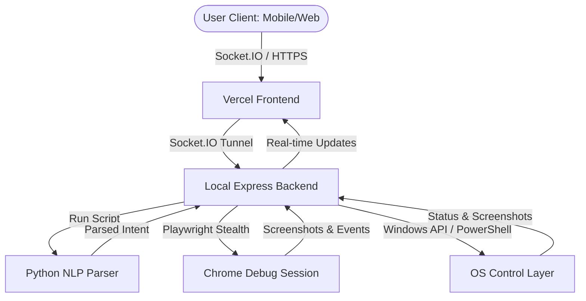

# 🤖 AGI (Autonomous GUI Intelligence)

AGI, short for **Autonomous GUI Intelligence**, is a local-first agentic AI chatbot system that allows you to control your Windows laptop through a modern, responsive chat interface. 

Rather than just answering questions, AGI acts as a digital operator—understanding natural language, launching applications, running web searches, controlling system settings, and capturing live screenshots to report progress back to your interface.

---

## 🌟 Key Features

* **🖥️ Local-First Desktop Control**: Run commands locally to launch apps (Chrome, VSCode, Task Manager, Settings, etc.) or trigger system actions (brightness, volume, mute, lock, shutdown).
* **🌐 Headless & Headful Browser Automation**: Search and interact with websites (YouTube, Gemini, ChatGPT, Claude, Perplexity) using stealth-configured Playwright browsers.
* **📱 Split/Remote Architecture**: Access and trigger commands from another device (like your phone) while execution happens locally on your laptop.
* **📸 Real-time Screenshots & Logs**: See step-by-step progress reports and visual proof of execution directly in your chat interface.
* **💬 Twilio WhatsApp Integration**: Control your laptop remotely using WhatsApp messages authenticated from authorized phone numbers.

---

## 📐 Architecture Overview



1. **Frontend (Vercel-ready React/Vite app)**: Serves as the interactive control UI.
2. **Backend (Local Express server)**: Connects to the frontend via Socket.IO, processes commands, and coordinates local automation.
3. **Execution Layer (Playwright, Puppeteer Stealth, PowerShell)**: Directly interfaces with your operating system and web browser sessions.

---

## ⚙️ Prerequisites

To run AGI locally, you need:

* **Node.js** (v18 or higher)
* **npm** (comes with Node)
* **Python 3.x** (with standard libraries for the NLP parser)
* **Google Chrome** installed at the default Windows location (`C:\Program Files\Google\Chrome\Application\chrome.exe`)
* **ngrok** or **cloudflared** (optional, for connecting a Vercel-hosted frontend to your local backend)

---

## 🚀 Step-by-Step Setup

### 1. Backend Setup

1. Open a terminal and navigate to the `backend` folder:
   ```bash
   cd backend
   ```
2. Install dependencies:
   ```bash
   npm install
   ```
3. Copy `.env.example` to `.env`:
   ```bash
   copy .env.example .env
   ```
4. Open `.env` and fill in your details:
   * **Gemini API Keys**: For processing intents.
   * **Twilio credentials**: (Optional) For WhatsApp integration.
   * **NGROK_AUTHTOKEN**: (Optional) For automated tunnel setup.

### 2. Frontend Setup

1. Navigate to the `frontend` folder:
   ```bash
   cd ../frontend
   ```
2. Install dependencies:
   ```bash
   npm install
   ```
3. Configure your API endpoint:
   * Create or update `.env` or `.env.production` and set:
     ```env
     VITE_BACKEND_URL=http://localhost:3001
     ```
   * *Note: If deploying the frontend to Vercel, change this to your public ngrok/cloudflare tunnel URL (e.g., `https://your-tunnel-name.ngrok-free.dev`).*

---

## ⚡ Running the App

### Option A: The One-Click Launcher (Recommended for Windows)

In the root directory, double-click **`start_full_app.bat`**. This script will:
1. Verify Node.js and dependencies.
2. Kill any conflicting Chrome sessions and relaunch Chrome in Remote Debugging mode on port `9222`.
3. Start the local backend on port `3001`.
4. Spin up an **ngrok** or **cloudflared** tunnel automatically (if installed) to make your backend publicly accessible.

### Option B: Manual Startup

If you prefer starting components manually:

1. **Launch Chrome in Debug Mode** (required for logged-in sessions):
   ```bash
   cmd /c launch_chrome_debug.bat
   ```
2. **Start Backend**:
   ```bash
   cd backend
   node server.js
   ```
3. **Start Frontend (Local Development)**:
   ```bash
   cd frontend
   npm run dev
   ```

---

## ☁️ Vercel Deployment

1. Push the `frontend` directory to GitHub and connect it to Vercel.
2. In the Vercel Dashboard, set the environment variable:
   * **`VITE_BACKEND_URL`** = `https://your-public-tunnel-url` (obtained from ngrok or cloudflared running on your laptop).
3. Open your laptop, run `start_full_app.bat` to keep the local execution server listening, and control your laptop from anywhere via the Vercel app URL!

---

## 🛠️ Troubleshooting

* **Dubious Ownership Errors (Git)**: If Git gives an ownership error during initialization, add the directory to safe directory list:
  ```bash
  git config --global --add safe.directory <path-to-project-root>
  ```
* **Chrome Debugger Port Conflict**: Ensure no other background Chrome processes are occupying port `9222`. The launcher script will automatically kill existing Chrome instances.
* **Socket Connection Issues**: If your client isn't receiving events, verify that the `VITE_BACKEND_URL` environment variable matches the exact protocol and port (or tunnel URL) of the running backend.
